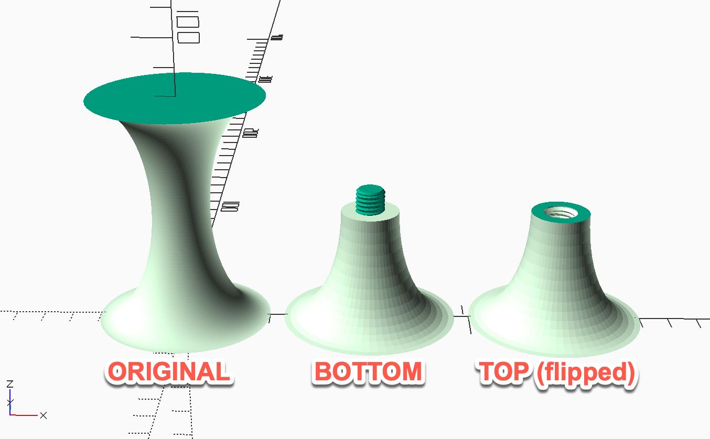

# split.scad

Split.scad is an OpenSCAD module to split a model in half on the XY plane and create screw threads thread between the two parts.



## Usage

The threaded portion is centered on [0,0] on the XY plane and extends in the Z plane.  THreads are cut with
 45 degree edges and shouldn't need support

### Required Parameters

*half* - either "bottom" or "top" to specify which half to generate.  Ultimately you have to do both.  
*z* - z value of where to split the model.  

### Optional PArameters

*diameter* - diameter of the threaded part, Obviously must be smaller than that part of the model.  
*pitch* - thread pitch in mm, e.g. 1.5mm.  
*length* = length of the threaded postion.  
*thread_slop* - extra doameter to make the female part of the thread, on the top piece.  
*reverse* - if true, place the male thread on the top piece.  

### Children

The model to split.
   
### Other
See the split_test or split_test2 module in the code for an example of how to use.

```
split(half="bottom", diameter=14, pitch=1.5, length=8) {
      Your model, centered at origin in x, y, and z
}
```
or, for the top.  You need to rotate this portion in X or Y and position it on the bed
```
translate([0,0,-MODEL_HEIGHT])
rotate([180,0,0])
split(half="top",diameter=14, pitch=1.5, length=8) {
    Your model again
}
```

The halves of the split model are left oriented just as they were in the full model

## License

[MIT](https:choosealicense.com/licenses/mit/)